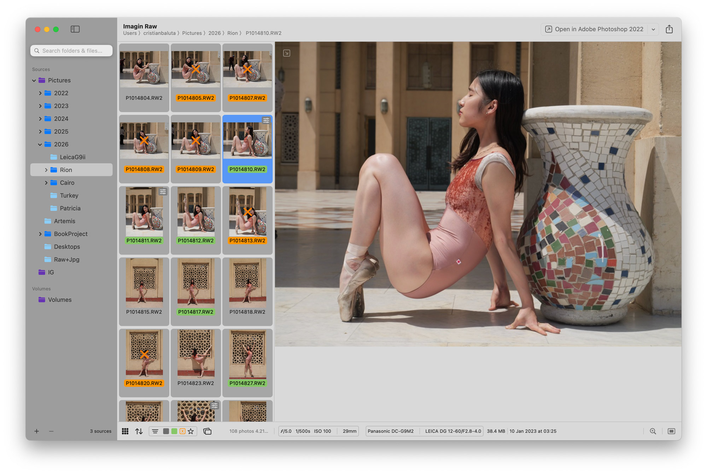
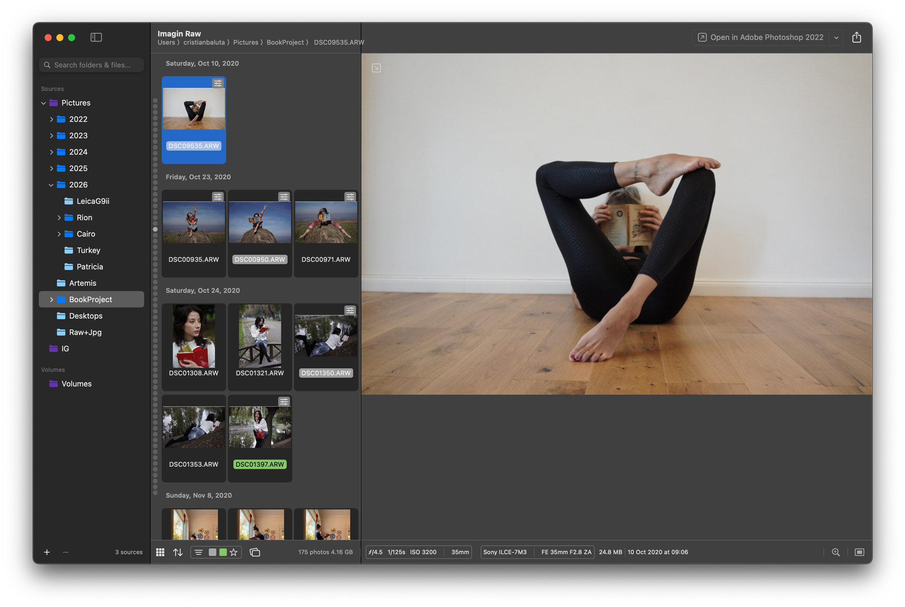
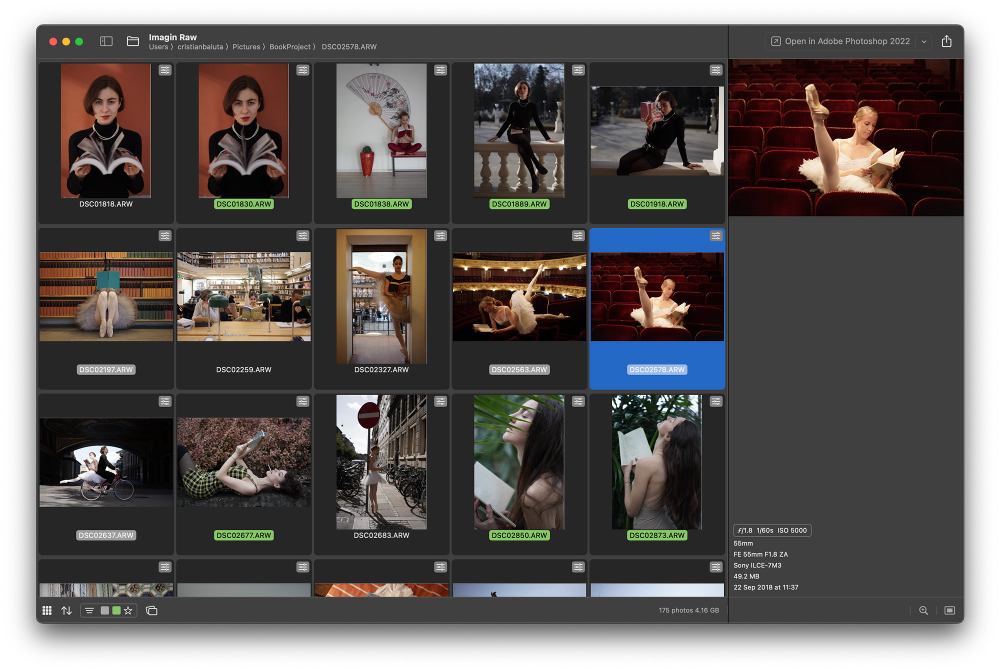
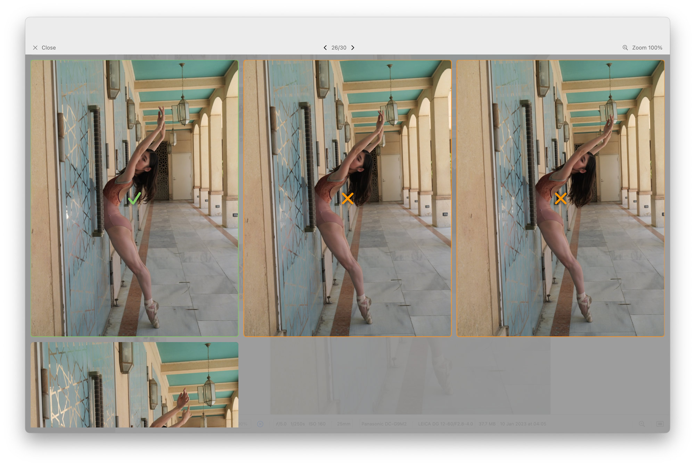

# Imagin RAW

A lightweight, native macOS application for browsing, culling, and organizing RAW photos - built as a more efficient alternative to Adobe Bridge for read/rate/organize workflows.

An iOS companion app is in development, focused on a simple way to browse your library, cleanup, in field backup of your shots, and scouting.

## Architecture

- **UI**: SwiftUI (macOS 14.6+). AppKit/UIKit for the thumbnails list where SwiftUI performance was poor
- **RAW decoding**: LibRaw (C++), wrapped via Objective-C++ bridge. CoreImage also used for other formats and as a fallback
- **Metadata**: EXIF parsed directly from RAW/JPEG binary structures; XMP sidecars read/written for Lightroom/Bridge compatibility
- **File system monitoring**: FSEvents for real-time folder change detection
- **Search**: NSMetadataQuery (Spotlight) for indexed file/folder search
- **Concurrency**: A mix of Tasks and OperationQueue

## Features

- **Multi-root folder browsing** - add any number of folders from local disks, external drives, or SD cards; no import step, no managed library
- **Real-time file system monitoring** - new photos, deletions, and folder structure changes are detected and reflected immediately
- **RAW format support** - via LibRaw, covering a broad range of camera manufacturers and formats
- **Rating and color labeling** - written to XMP sidecars (RAW) or embedded directly without re-encoding (JPEG/HEIC), compatible with Adobe Bridge and Lightroom
- **Rejection workflow** - a session-scoped label (not persisted across folder changes) for marking photos to delete; batch-delete via right-click
- **JPG/RAW pair deduplication** - when a RAW+JPEG pair exists, only the RAW is shown in the browser
- **Two grid layouts** - compact grid (more room for preview) and large grid (more room for browsing)
- **Spotlight-backed search** - search across files and folder names using the macOS indexing engine
- **SD card ingest** - copy photos into date-based folder structures, with optional simultaneous backup to a second destination
- **Duplicate/similar photo detection** - Review mode for quickly resolving near-duplicate burst shots
- **Instagram frame export** - fits 2:3 RAW images into a 3:4 canvas, exported as PNG to avoid re-encoding loss (useful for Camera Raw edits because it doesn't support framing)

## Comparison with Adobe Bridge

### Where Imagin RAW is better

| | Imagin RAW | Bridge |
|---|---|---|
| App size | ~9 MB | ~2 GB |
| Idle CPU | 0% | non-zero |
| Memory | As low as 100 MB depending on the album | Easily gets to GBs |
| Launch time | Near-instant | Many seconds |
| Scrolling | Native, smooth | Row-jumping |
| External drive eject | No app restart needed | Requires quitting Bridge |

### Where Bridge is ahead

- **Camera Raw–processed previews** - Bridge renders thumbnails with ACR adjustments applied. Imagin RAW currently shows unprocessed previews; replicating the ACR pipeline isn't feasible, though basic exposure/crop preview adjustments may be explored.

## Roadmap
See the open [Issues](https://github.com/cristibaluta/Imagin-Raw/issues)

## Screenshots

## Keyboard Shortcuts
- **Arrow Keys** - Navigate between photos
- **CMD A** - Select all photos
- **CMD Click / Shift+Click** - Multi-select photos
- **CMD Del** - Move photos to trash
- **CMD Z** - Undo photos moved to trash
- **1-5** - Set Star Rating
- **6-0** - Apply Labels
- **-** - Remove label
- **A** - Approve photos (same as the 8 key)
- **X / Del** - Reject photos
- **OPT 1-5** - Filter by Star Rating
- **OPT 6-0** - Filter by Labels
- **OPT X** - Filter by Rejected
- **C** - Toggle Sidebar
- **G** - Toggle Grid Type
- **Return** - Open selected photo(s) in external editor

## System Requirements
- macOS 14.6 or later
- Apple Silicon or Intel processor

## Installation
- Buy from the [AppStore](https://apps.apple.com/ro/app/imagin-raw/id6760548347?mt=12) if you want to support the project and receive updates automatically
- Download the latest release from [Releases](https://github.com/cristibaluta/Imagin-Raw/releases). Updates might not be on par with the AppStore and there's no update notification in app
- Compile from source code

## Contributions
Small straightforward fixes and issue/ideas reportings are welcome.
