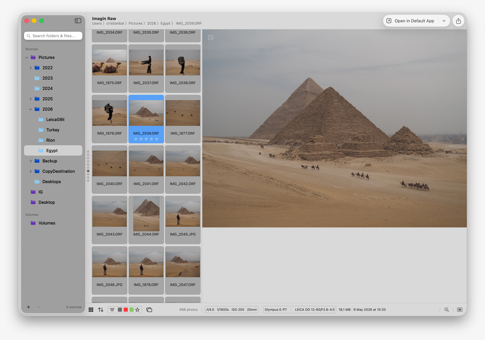

# Imagin Raw

A lightweight, fast, and native macOS application for managing and organizing RAW photos, built as an alternative to Adobe Bridge. Built by photographers for photographers.
There is also an iOS version in the works that is supposed to greatly simplify the browsing of your photos but also provide a better way to rate your photos. It wants also to be a tool for scouting.

## Features
- **Add multiple root folders** from anywhere on your system or external drives and SD cards
- **Real-time file system monitoring** - automatically detects new photos, deletions, and folder changes
- **RAW format support** app uses the libraw lib, many raw files are supported
- **Rating and labeling** compatible with Adobe Bridge
- **Rejections** This will not delete the photos right away, it's a temporary label that you can filter for. This label is not preserver between album changes.
- **XMP metadata sidecar** - compatible with Adobe Lightroom and Bridge (DXO on the TODO)
- **JPG counterparts** are hidden, when you browse the photos you see only the raw versions
- **2 grid types**
- **Search** through files and folders. It uses the macOS Spotlight engine
- **Copy** images from SD card to your computer and organize automatically into folders and subfolders. Alternatively a copy to a second location can be made
- **Find duplicates** or similar pictures and decide faster which ones to keep in Review mode
- **Add frame** If you edit in CameraRaw you can't add a frame to your pictures, but you can add one in Imagin Raw and export as png to avoid loosing quality after reencoding. This is useful to make 2x3 images fit into 3x4 format for instagram

## Advantages over Bridge
- Fast launch. The goal is to make it feel like a Finder window that you can keep open at all times
- Lightweight: 14Mb vs 2Gb
- Light CPU usage. In idle it takes 0%, Bridge always consumes something. When reading the metadata it uses all the available cores so you will see a short spike
- Light memory usage. It can go up for large albums but the memory is also released
- Native scrolling feel. Bridge jumps in rows and feels hard to control
- External drives can be ejected while the app is open. Bridge needs to be quit before ejecting

## Bridge advantages over Imagin Raw
- Previews have the Camera Raw editings applied to them. This is not possible to implement since it uses the ACR engine. Might be possible to do basic adjustments and crop, will look into it

## Screenshots

## Keyboard Shortcuts
- **Arrow Keys** - Navigate between photos
- **CMD A** - Select all photos
- **CMD Click / Shift+Click** - Multi-select photos
- **CMD Del** - Move photos to trash
- **CMD Z** - Undo photos moved to trash
- **1-5** - Set Star Rating
- **6-0** - Apply Labels
- **-** - Remove label
- **A** - Approve photos (same as the 8 key)
- **X / Del** - Reject photos
- **OPT 1-5** - Filter by Star Rating
- **OPT 6-0** - Filter by Labels
- **OPT X** - Filter by Rejected
- **C** - Toggle Sidebar
- **G** - Toggle Grid Type
- **Return** - Open selected photo(s) in external editor

## System Requirements
- macOS 14.6 or later
- Apple Silicon or Intel processor

## Installation
- Download the latest release from Releases. Updates will be irregular and you need to check them yourself
- Buy from the Appstore if you want to support the project and receive updates automatically

## Contributions
Small straightforward fixes are welcome. Large PRs with new features needs to be discussed first.
